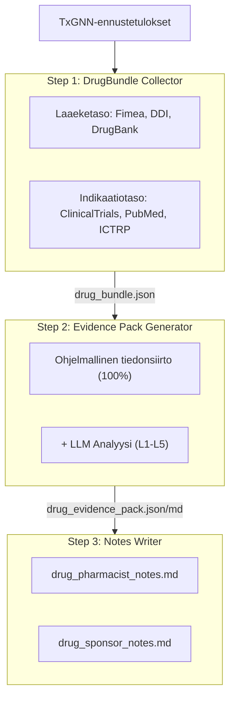
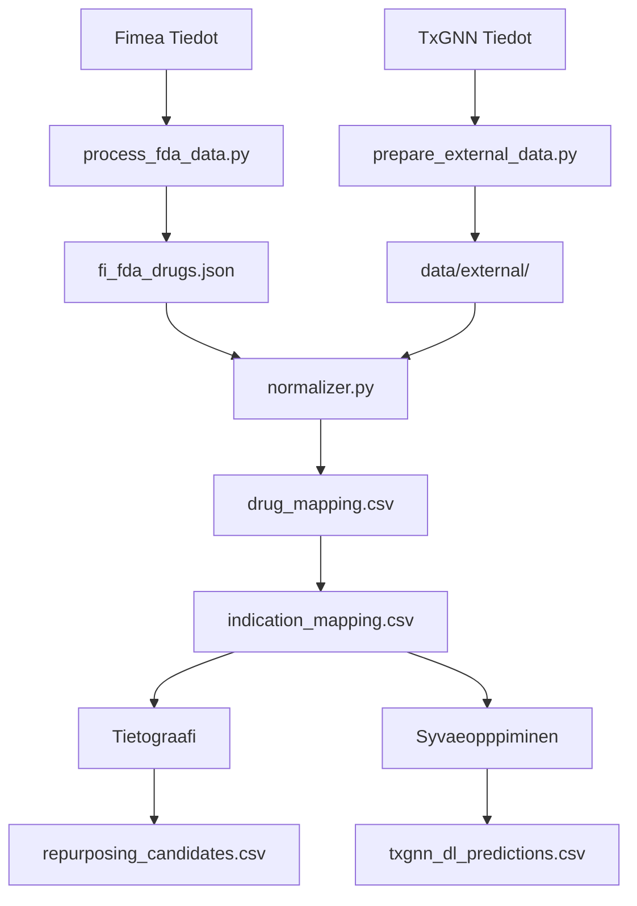

# FITxGNN - Suomi: Laakkeiden uudelleenkaytto

[](https://fitxgnn.yao.care)
[](https://opensource.org/licenses/MIT)

Laakkeiden uudelleenkayton ennusteita Finland Fimea-hyvaksytyille laakkeille TxGNN-mallilla.

## Vastuuvapauslauseke

- Taemaen projektin tulokset ovat vain tutkimustarkoituksiin eivaetkae muodosta laeketieteen neuvontaa.
- Laaekkeiden uudelleenkaeytoeen ehdokkaat vaativat kliinisen validoinnin ennen soeveltamista.

## Projektin yleiskatsaus

### Raporttitilastot

| Kohde | Maaerae |
|------|------|
| **Laaekeraportteja** | 466 |
| **Ennusteita yhteensae** | 2,539,217 |
| **Ainutlaatuisia laaekkeitae** | 641 |
| **Ainutlaatuisia indikaatioita** | 17,041 |
| **DDI-tiedot** | 302,516 |
| **DFI-tiedot** | 857 |
| **DHI-tiedot** | 35 |
| **DDSI-tiedot** | 8,359 |
| **FHIR-resurssit** | 466 MK / 2,395 CUD |

### Naeytoetasojakauma

| Naeytoetaso | Raporttien maaerae | Kuvaus |
|---------|-------|------|
| **L1** | 0 | Useita vaiheen 3 RCT:itae |
| **L2** | 0 | Yksittaeinen RCT tai useita vaiheen 2 |
| **L3** | 0 | Havainnointitutkimuksia |
| **L4** | 0 | Prekliinisiaeresearchaanistisia tutkimuksia |
| **L5** | 466 | Vain laskennallinen ennuste |

### Lahteen mukaan

| Lahde | Ennusteita |
|------|------|
| DL | 2,536,822 |
| KG + DL | 2,149 |
| KG | 246 |

### Luottamuksen mukaan

| Luottamus | Ennusteita |
|------|------|
| very_high | 1,688 |
| high | 117,105 |
| medium | 231,216 |
| low | 2,189,208 |

---

## Ennustemenetelmät

| Menetelma | Nopeus | Tarkkuus | Vaatimukset |
|------|------|--------|----------|
| Tietograafi | Nopea (sekunteja) | Alempi | Ei erityisvaatimuksia |
| Syvaeopppiminen | Hidas (tunteja) | Ylempi | Conda + PyTorch + DGL |

### Tietograafimenetelma

```bash
uv run python scripts/run_kg_prediction.py
```

| Mittari | Arvo |
|------|------|
| Fimea Laaekkeitae yhteensae | 1,850 |
| Kartoitettu DrugBankiin | 1,334 (72.1%) |
| Uudelleenkaeytoeen ehdokkaat | 2,395 |

### Syvaoppimismenetelma

```bash
conda activate txgnn
PYTHONPATH=src python -m fitxgnn.predict.txgnn_model
```

| Mittari | Arvo |
|------|------|
| DL-ennusteita yhteensae | 1,472,850 |
| Ainutlaatuisia laaekkeitae | 641 |
| Ainutlaatuisia indikaatioita | 17,041 |

### Pistetulkinta

TxGNN-pistemaeaerae edustaa mallin luottamusta laake-sairauspariin, vaihteluvaeli 0-1.

| Kynnysarvo | Merkitys |
|-----|------|
| >= 0.9 | Erittaein korkea luottamus |
| >= 0.7 | Korkea luottamus |
| >= 0.5 | Kohtalainen luottamus |

#### Pistejakauma

| Kynnysarvo | Merkitys |
|-----|------|
| ≥ 0.9999 | Erittaein korkea luottamus, mallin varmimmat ennusteet |
| ≥ 0.99 | Hyvin korkea luottamus, kannattaa priorisoida validointiin |
| ≥ 0.9 | Korkea luottamus |
| ≥ 0.5 | Kohtalainen luottamus (sigmoid-paeaetoesraja) |

#### Naeyttoetoasojen maeaeritelmae

| Taso | Maeaeritelmae | Kliininen merkitys |
|-----|------|---------|
| L1 | Vaiheen 3 RCT tai systemaattinen katsaus | Voi tukea kliinistae kaeyttoeae |
| L2 | Vaiheen 2 RCT | Voidaan harkita kaeytoettaevaeksi |
| L3 | Vaihe 1 tai havainnointitutkimus | Vaatii lisaeaarviointia |
| L4 | Tapausraportti tai prekliininen tutkimus | Ei vielae suositeltu |
| L5 | Vain laskennallinen ennuste, ei kliinistae naeyttoeae | Vaatii lisaetutkimusta |

#### Taerkeaet muistutukset

1. **Korkeat pisteet eivae takaa kliinistae tehoa: TxGNN-pisteet ovat tietograafipohjaisia ennusteita, jotka vaativat kliinisen validoinnin.**
2. **Matalat pisteet eivae tarkoita tehottomuutta: malli ei ehkae ole oppinut tiettyjae yhteyksia.**
3. **Suositellaan kaeytettaevaeksi validointiprosessin kanssa: kaeytae taemaen projektin tyoekaluja kliinisten tutkimusten, kirjallisuuden ja muun naeytoen tarkasteluun.**

### Validointiprosessi



---

## Pikaopas

### Vaihe 1: Lataa tiedot

| Tiedosto | Lataus |
|------|------|
| Fimea Tiedot | [EMA Medicines Data (proxy for Finnish-authorized medicines)](https://www.ema.europa.eu/en/medicines/download-medicine-data) |
| node.csv | [Harvard Dataverse](https://dataverse.harvard.edu/api/access/datafile/7144482) |
| kg.csv | [Harvard Dataverse](https://dataverse.harvard.edu/api/access/datafile/7144484) |
| edges.csv | [Harvard Dataverse](https://dataverse.harvard.edu/api/access/datafile/7144483) |
| model_ckpt.zip | [Google Drive](https://drive.google.com/uc?id=1fxTFkjo2jvmz9k6vesDbCeucQjGRojLj) |

### Vaihe 2: Asenna riippuvuudet

```bash
uv sync
```

### Vaihe 3: Kaesittele laaeketiedot

```bash
uv run python scripts/process_fda_data.py
```

### Vaihe 4: Valmistele sanastotiedot

```bash
uv run python scripts/prepare_external_data.py
```

### Vaihe 5: Suorita tietograafiennuste

```bash
uv run python scripts/run_kg_prediction.py
```

### Vaihe 6: Maaeritae syvaoppimisympaeristo

```bash
conda create -n txgnn python=3.11 -y
conda activate txgnn
pip install torch==2.2.2 torchvision==0.17.2
pip install dgl==1.1.3
pip install git+https://github.com/mims-harvard/TxGNN.git
pip install pandas tqdm pyyaml pydantic ogb
```

### Vaihe 7: Suorita syvaoppimisennuste

```bash
conda activate txgnn
PYTHONPATH=src python -m fitxgnn.predict.txgnn_model
```

---

## Resurssit

### TxGNN Ydin

- [TxGNN Paper](https://www.nature.com/articles/s41591-024-03233-x) - Nature Medicine, 2024
- [TxGNN GitHub](https://github.com/mims-harvard/TxGNN)
- [TxGNN Explorer](http://txgnn.org)

### Tietolahteet

| Kategoria | Tiedot | Lahde | Huomautus |
|------|------|------|------|
| **Laaeketiedot** | Fimea | [EMA Medicines Data (proxy for Finnish-authorized medicines)](https://www.ema.europa.eu/en/medicines/download-medicine-data) | Finland |
| **Tietograafi** | TxGNN KG | [Harvard Dataverse](https://dataverse.harvard.edu/dataset.xhtml?persistentId=doi:10.7910/DVN/IXA7BM) | 17,080 diseases, 7,957 drugs |
| **Laaeketietokanta** | DrugBank | [DrugBank](https://go.drugbank.com/) | Laakeainekartoitus |
| **Laakeinteraktiot** | DDInter 2.0 | [DDInter](https://ddinter2.scbdd.com/) | DDI-parit |
| **Laakeinteraktiot** | Guide to PHARMACOLOGY | [IUPHAR/BPS](https://www.guidetopharmacology.org/) | Hyvaksytyt laakeinteraktiot |
| **Kliiniset tutkimukset** | ClinicalTrials.gov | [CT.gov API v2](https://clinicaltrials.gov/data-api/api) | Kliinisten tutkimusten rekisteri |
| **Kliiniset tutkimukset** | WHO ICTRP | [ICTRP API](https://apps.who.int/trialsearch/api/v1/search) | Kansainvaelinen kliinisten tutkimusten alusta |
| **Kirjallisuus** | PubMed | [NCBI E-utilities](https://eutils.ncbi.nlm.nih.gov/entrez/eutils/) | Laaketieteellinen kirjallisuushaku |
| **Nimikartoitus** | RxNorm | [RxNav API](https://rxnav.nlm.nih.gov/REST) | Laakenimien standardointi |
| **Nimikartoitus** | PubChem | [PUG-REST API](https://pubchem.ncbi.nlm.nih.gov/docs/pug-rest) | Kemiallisten aineiden synonyymit |
| **Nimikartoitus** | ChEMBL | [ChEMBL API](https://www.ebi.ac.uk/chembl/api/data) | Bioaktiivisuustietokanta |
| **Standardit** | FHIR R4 | [HL7 FHIR](http://hl7.org/fhir/) | MedicationKnowledge, ClinicalUseDefinition |
| **Standardit** | SMART on FHIR | [SMART Health IT](https://smarthealthit.org/) | EHR-integraatio, OAuth 2.0 + PKCE |

### Mallien lataukset

| Tiedosto | Lataus | Huomautus |
|------|------|------|
| Esikoulutettu malli | [Google Drive](https://drive.google.com/uc?id=1fxTFkjo2jvmz9k6vesDbCeucQjGRojLj) | model_ckpt.zip |
| node.csv | [Harvard Dataverse](https://dataverse.harvard.edu/api/access/datafile/7144482) | Solmutiedot |
| kg.csv | [Harvard Dataverse](https://dataverse.harvard.edu/api/access/datafile/7144484) | Tietograafitiedot |
| edges.csv | [Harvard Dataverse](https://dataverse.harvard.edu/api/access/datafile/7144483) | Reunatiedot (DL) |

## Projektin esittely

### Hakemistorakenne

```
FITxGNN/
├── README.md
├── CLAUDE.md
├── pyproject.toml
│
├── config/
│   └── fields.yaml
│
├── data/
│   ├── kg.csv
│   ├── node.csv
│   ├── edges.csv
│   ├── raw/
│   ├── external/
│   ├── processed/
│   │   ├── drug_mapping.csv
│   │   ├── repurposing_candidates.csv
│   │   ├── txgnn_dl_predictions.csv.gz
│   │   └── integration_stats.json
│   ├── bundles/
│   └── collected/
│
├── src/fitxgnn/
│   ├── data/
│   │   └── loader.py
│   ├── mapping/
│   │   ├── normalizer.py
│   │   ├── drugbank_mapper.py
│   │   └── disease_mapper.py
│   ├── predict/
│   │   ├── repurposing.py
│   │   └── txgnn_model.py
│   ├── collectors/
│   └── paths.py
│
├── scripts/
│   ├── process_fda_data.py
│   ├── prepare_external_data.py
│   ├── run_kg_prediction.py
│   └── integrate_predictions.py
│
├── docs/
│   ├── _drugs/
│   ├── fhir/
│   │   ├── MedicationKnowledge/
│   │   └── ClinicalUseDefinition/
│   └── smart/
│
├── model_ckpt/
└── tests/
```

**Selite**: 🔵 Projektikehitys | 🟢 Paikalliset tiedot | 🟡 TxGNN-tiedot | 🟠 Validointiprosessi

### Tietovirta



---

## Viittaus

Jos kaytat tata tietoaineistoa tai ohjelmistoa, viittaa:

```bibtex
@software{fitxgnn2026,
  author       = {Yao.Care},
  title        = {FITxGNN: Drug Repurposing Validation Reports for Finland Fimea Drugs},
  year         = 2026,
  publisher    = {GitHub},
  url          = {https://github.com/yao-care/FITxGNN}
}
```

Viittaa myos alkuperaiseen TxGNN-artikkeliin:

```bibtex
@article{huang2023txgnn,
  title={A foundation model for clinician-centered drug repurposing},
  author={Huang, Kexin and Chandak, Payal and Wang, Qianwen and Haber, Shreyas and Zitnik, Marinka},
  journal={Nature Medicine},
  year={2023},
  doi={10.1038/s41591-023-02233-x}
}
```
